```mermaid
classDiagram
    %% ===================
    %% DOMAIN CORE (CENTER)
    %% ===================
    
    class Logement {
        +String id
        +String name
        +f64 price
        +Option~String~ location
        +new(id: String, name: String, price: f64) Logement
        +validate() Result~(), DomainError~
    }

    class LogementCollection {
        +Vec~Logement~ logements
        +DateTime created_at
        +new() LogementCollection
        +add_logement(logement: Logement)
        +get_ids() Vec~String~
        +size() usize
        +is_empty() bool
    }

    class LogementDomainService {
        +validate_collection(collection: &LogementCollection) Result~(), DomainError~
        +calculate_statistics(collection: &LogementCollection) LogementStats
    }

    class LogementStats {
        +usize total_count
        +f64 average_price
    }

    class DomainError {
        <<enumeration>>
        InvalidData(String)
        ValidationFailed(String)
    }

    %% ===================
    %% PORTS (INTERFACES)
    %% ===================
    
    %% Primary Port (Inbound)
    class LogementUseCase {
        <<interface>>
        +collect_and_store() Result~CollectionResult, AppError~
        +get_statistics() Result~LogementStats, AppError~
    }

    class CollectionResult {
        +usize processed_count
        +usize stored_count
    }

    %% Secondary Ports (Outbound)
    class DataProvider {
        <<interface>>
        +fetch_logements() Result~LogementCollection, DataError~
    }

    class DataSaver {
        <<interface>>
        +save_logements(logements: &[Logement]) Result~Vec~String~, SaveError~
        +save_snapshot(ids: Vec~String~) Result~(), SaveError~
    }

    %% ===================
    %% APPLICATION LAYER
    %% ===================
    
    class LogementService {
        -LogementDomainService domain_service
        -Box~dyn DataProvider~ data_provider
        -Box~dyn DataSaver~ data_saver
        +new(domain_service: LogementDomainService, data_provider: Box~dyn DataProvider~, data_saver: Box~dyn DataSaver~) LogementService
        +collect_and_store() Result~CollectionResult, AppError~
        +get_statistics() Result~LogementStats, AppError~
    }

    %% ===================
    %% ADAPTERS (INFRASTRUCTURE)
    %% ===================
    
    %% Primary Adapter (Driving)
    class CliApp {
        -Box~dyn LogementUseCase~ use_case
        +new(use_case: Box~dyn LogementUseCase~) CliApp
        +run() Result~(), CliError~
    }

    %% Secondary Adapters (Driven)
    class CrousApiProvider {
        -reqwest::Client http_client
        -String base_url
        +new(base_url: String) CrousApiProvider
        +fetch_logements() Result~LogementCollection, DataError~
    }

    class MongoDataSaver {
        -mongodb::Client client
        -String database
        +new(client: mongodb::Client, database: String) MongoDataSaver
        +save_logements(logements: &[Logement]) Result~Vec~String~, SaveError~
        +save_snapshot(ids: Vec~String~) Result~(), SaveError~
    }

    %% ===================
    %% CONFIGURATION
    %% ===================
    
    class AppConfig {
        +String mongodb_uri
        +String crous_url
        +from_env() Result~AppConfig, ConfigError~
    }

    %% ===================
    %% ERROR TYPES
    %% ===================
    
    class AppError {
        <<enumeration>>
        Domain(DomainError)
        DataProvider(DataError)
        DataSaver(SaveError)
    }

    class DataError {
        <<enumeration>>
        HttpError(String)
        ParseError(String)
        ConnectionFailed(String)
    }

    class SaveError {
        <<enumeration>>
        ConnectionFailed(String)
        InsertFailed(String)
        ValidationFailed(String)
    }

    class ConfigError {
        <<enumeration>>
        MissingEnvVar(String)
        InvalidValue(String)
    }

    class CliError {
        <<enumeration>>
        AppError(AppError)
        ConfigError(ConfigError)
    }

    %% ===================
    %% DEPENDENCY INJECTION
    %% ===================
    
    class AppBuilder {
        +new() AppBuilder
        +build_from_config(config: AppConfig) Result~CliApp, AppError~
    }

    %% ===================
    %% RELATIONSHIPS
    %% ===================
    
    %% Domain relationships
    LogementCollection "1" *-- "0..*" Logement : contains
    LogementDomainService --> LogementCollection : operates on
    LogementDomainService --> LogementStats : produces

    %% Port implementations
    LogementService ..|> LogementUseCase : implements
    CrousApiProvider ..|> DataProvider : implements
    MongoDataSaver ..|> DataSaver : implements

    %% Application Service dependencies
    LogementService --> LogementDomainService : uses
    LogementService --> DataProvider : depends on
    LogementService --> DataSaver : depends on

    %% Primary Adapter
    CliApp --> LogementUseCase : drives

    %% Error hierarchy
    AppError ..> DomainError : contains
    AppError ..> DataError : contains
    AppError ..> SaveError : contains
    CliError ..> AppError : contains
    CliError ..> ConfigError : contains

    %% Builder relationships
    AppBuilder ..> CliApp : creates
    AppBuilder ..> LogementService : creates
    AppBuilder ..> CrousApiProvider : creates
    AppBuilder ..> MongoDataSaver : creates
    AppBuilder --> AppConfig : uses

    %% Configuration
    LogementService --> AppConfig : configured by
    CrousApiProvider --> AppConfig : configured by
    MongoDataSaver --> AppConfig : configured by
```

## Simplified Hexagonal Architecture

### Core Architecture:

1. **Domain Core**: `Logement`, `LogementCollection`, `LogementDomainService`
2. **Primary Port**: `LogementUseCase` (what the app can do)
3. **Secondary Ports**: `DataProvider`, `DataSaver` (what the app needs)
4. **Application Service**: `LogementService` (orchestrates domain + external dependencies)
5. **Adapters**: `CliApp` (primary), `CrousApiProvider` + `MongoDataSaver` (secondary)

### Key Simplifications:

- **Separated concerns**: `DataProvider` for fetching, `DataSaver` for persistence
- **Removed excessive value objects** (Money, Currency, etc.) - keeping it simple with primitives
- **Consolidated error types** - fewer, more focused error categories
- **Simplified configuration** - basic environment-based config
- **Removed notification complexity** - focus on core functionality
- **Single primary adapter** - CLI only (can add REST later if needed)
- **Streamlined domain model** - essential properties only

### Benefits Maintained:

- ✅ **Domain independence** - business logic isolated
- ✅ **Testability** - easy to mock ports
- ✅ **Flexibility** - can swap implementations
- ✅ **Clean dependencies** - inward-pointing dependencies
- ✅ **Separation of concerns** - clear layer boundaries
- ✅ **Single Responsibility** - separate ports for data fetching and saving

This simplified version maintains hexagonal architecture principles while being much easier to understand and implement.
