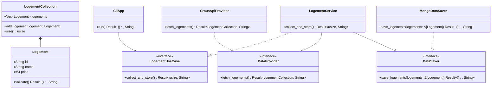

## Simplified Hexagonal Architecture

### Core Components:

1. **Domain**: `Logement`, `LogementCollection`
2. **Ports**: `LogementUseCase`, `DataProvider`, `DataSaver`
3. **Application**: `LogementService`
4. **Adapters**: `CliApp`, `CrousApiProvider`, `MongoDataSaver`

### Key Simplifications:

- ✅ **Removed complex error hierarchies** - using simple `String` errors
- ✅ **Eliminated domain services** - keeping business logic in entities
- ✅ **Simplified configuration** - removed `AppConfig` and `AppBuilder`
- ✅ **Reduced method signatures** - fewer parameters and return types
- ✅ **Streamlined relationships** - only essential dependencies shown
- ✅ **Single responsibility** - each class has one clear purpose

### Architecture Benefits:

- 🎯 **Easy to understand** - minimal cognitive load
- 🔧 **Easy to implement** - straightforward code structure
- 🧪 **Easy to test** - clear interfaces for mocking
- 📦 **Easy to extend** - can add new adapters without changing core

This ultra-simplified version maintains hexagonal architecture principles while being extremely easy to implement and understand.
        +save_snapshot(ids: Vec~String~) Result~(), SaveError~
    }

    %% ===================
    %% CONFIGURATION
    %% ===================
    
    class AppConfig {
        +String mongodb_uri
        +String crous_url
        +from_env() Result~AppConfig, ConfigError~
    }

    %% ===================
    %% ERROR TYPES
    %% ===================
    
    class AppError {
        <<enumeration>>
        Domain(DomainError)
        DataProvider(DataError)
        DataSaver(SaveError)
    }

    class DataError {
        <<enumeration>>
        HttpError(String)
        ParseError(String)
        ConnectionFailed(String)
    }

    class SaveError {
        <<enumeration>>
        ConnectionFailed(String)
        InsertFailed(String)
        ValidationFailed(String)
    }

    class ConfigError {
        <<enumeration>>
        MissingEnvVar(String)
        InvalidValue(String)
    }

    class CliError {
        <<enumeration>>
        AppError(AppError)
        ConfigError(ConfigError)
    }

    %% ===================
    %% DEPENDENCY INJECTION
    %% ===================
    
    class AppBuilder {
        +new() AppBuilder
        +build_from_config(config: AppConfig) Result~CliApp, AppError~
    }

    %% ===================
    %% RELATIONSHIPS
    %% ===================
    
    %% Domain relationships
    LogementCollection "1" *-- "0..*" Logement : contains
    LogementDomainService --> LogementCollection : operates on
    LogementDomainService --> LogementStats : produces

    %% Port implementations
    LogementService ..|> LogementUseCase : implements
    CrousApiProvider ..|> DataProvider : implements
    MongoDataSaver ..|> DataSaver : implements

    %% Application Service dependencies
    LogementService --> LogementDomainService : uses
    LogementService --> DataProvider : depends on
    LogementService --> DataSaver : depends on

    %% Primary Adapter
    CliApp --> LogementUseCase : drives

    %% Error hierarchy
    AppError ..> DomainError : contains
    AppError ..> DataError : contains
    AppError ..> SaveError : contains
    CliError ..> AppError : contains
    CliError ..> ConfigError : contains

    %% Builder relationships
    AppBuilder ..> CliApp : creates
    AppBuilder ..> LogementService : creates
    AppBuilder ..> CrousApiProvider : creates
    AppBuilder ..> MongoDataSaver : creates
    AppBuilder --> AppConfig : uses

    %% Configuration
    LogementService --> AppConfig : configured by
    CrousApiProvider --> AppConfig : configured by
    MongoDataSaver --> AppConfig : configured by
```

## Simplified Hexagonal Architecture

### Core Architecture:

1. **Domain Core**: `Logement`, `LogementCollection`, `LogementDomainService`
2. **Primary Port**: `LogementUseCase` (what the app can do)
3. **Secondary Ports**: `DataProvider`, `DataSaver` (what the app needs)
4. **Application Service**: `LogementService` (orchestrates domain + external dependencies)
5. **Adapters**: `CliApp` (primary), `CrousApiProvider` + `MongoDataSaver` (secondary)

### Key Simplifications:

- **Separated concerns**: `DataProvider` for fetching, `DataSaver` for persistence
- **Removed excessive value objects** (Money, Currency, etc.) - keeping it simple with primitives
- **Consolidated error types** - fewer, more focused error categories
- **Simplified configuration** - basic environment-based config
- **Removed notification complexity** - focus on core functionality
- **Single primary adapter** - CLI only (can add REST later if needed)
- **Streamlined domain model** - essential properties only

### Benefits Maintained:

- ✅ **Domain independence** - business logic isolated
- ✅ **Testability** - easy to mock ports
- ✅ **Flexibility** - can swap implementations
- ✅ **Clean dependencies** - inward-pointing dependencies
- ✅ **Separation of concerns** - clear layer boundaries
- ✅ **Single Responsibility** - separate ports for data fetching and saving

This simplified version maintains hexagonal architecture principles while being much easier to understand and implement.
